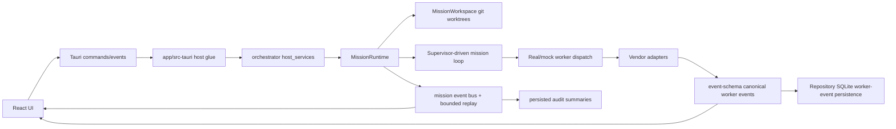

# Vigla Architecture

Vigla is split into a Tauri host, a React frontend, and a Rust
orchestrator. The core rule is simple: **UI hosts integrate; the
orchestrator owns business behavior.** Adapters are pure line-by-line
translators with no IO. Persistence and process management live in the
orchestrator. This document is the canonical design reference; the root
[`README.md`](./README.md) covers *what* Vigla is, *how to install
and run it*, and *how to compare it* to alternatives — but defers all
design depth to this file.

File pointers below are paths from the repo root, verified on 2026-07-21.

## High-Level Flow



## Crates and Responsibilities

| Area | Path | Responsibility |
| --- | --- | --- |
| Frontend | `app/src/` | React UI, keyboard handling, visual mission/worker state |
| Tauri host | `app/src-tauri/src/lib.rs` | IPC registration, app setup, typed event forwarding |
| Host services | `crates/orchestrator/src/host_services.rs` | Host-independent validation, mission lifecycle locking, backend routing |
| Mission runtime | `crates/orchestrator/src/mission_runtime/` | Mission state machine, mock timeline, event replay, merge/abort/resolve |
| Supervisor loop | `crates/orchestrator/src/mission_supervisor_run/` | Real/scripted supervisor turns, prompts, budget events, worker review loop |
| Worker supervisor | `crates/orchestrator/src/supervisor/` | Standalone worker process lifecycle, retry coordination, resume support |
| Git workspace | `crates/orchestrator/src/mission_workspace/mod.rs` | Mission branches, worktrees, integrations, final merge/discard |
| Event schema | `crates/event-schema/` | Canonical typed event contract shared by adapters and UI |
| Adapters | `crates/adapters/*` | Pure line-by-line translation from vendor CLI streams to canonical events |
| Vendor profiles | `crates/orchestrator/resources/vendor_profiles/` | Command rendering policy for supported CLIs |

## Adapter Boundary

Adapters are the main contribution surface.

An adapter:

- Receives one stdout/stderr line at a time.
- Maintains only local parser state such as sequence number, current
  session id, or accumulated assistant text.
- Emits zero or more canonical `event_schema::Event` values.
- Does not spawn processes, read or write files, call git, or persist
  data.

Process management belongs in `crates/orchestrator/src/supervisor/` and
`crates/orchestrator/src/mission_worker_dispatch.rs`. Persistence belongs in
`crates/orchestrator/src/repository/mod.rs`.

## Memory Kernel — `crates/orchestrator/src/memory/`

Local, event-sourced long-term memory. Six anchoring design choices:

| # | Design choice | Where |
|---|---|---|
| 1 | **Single-writer to project memory.** Vendor native files (`CLAUDE.md`/`AGENTS.md`/`GEMINI.md`) are render *targets*, never read as truth. | `memory/mod.rs:4-7` |
| 2 | **Event-sourced.** Witnesses are append-only; confidence is *derived* by `scoring.rs`, not stored. Weight changes need no migration. | `memory/witnesses.rs:1-7` |
| 3 | **Anchored block.** Kernel owns one delimited region per native file; everything outside is preserved byte-exact across writes. | `memory/coherence.rs:1-13` |
| 4 | **Per-repo isolation.** A registry opens one kernel per canonical repo root at `<repo>/.vigla/memory/memory.sqlite`. | `memory/registry.rs:1-37` |
| 5 | **Pre-event secret scanning.** Patterns + 20-char-window entropy detector run *before* `MemoryProposed` persists. | `memory/scanner.rs:1-19` |
| 6 | **Fail-soft attach.** Errors from listing / composing / rendering are swallowed + logged; memory must never block mission dispatch. | `memory/attach.rs:9-18` |

**Phase status** (`memory/mod.rs:9-45`). P0/P1 shipped. P2 completed the
closed loop: *worker proposes → supervisor ratifies → mission accept promotes →
next mission's composer picks it up*. P3 is also complete: alias-expanded BM25,
optional local MiniLM embeddings, MMR diversity, retrieval-driven composition,
and BM25-only graceful degradation all ship behind stable interfaces.

**Note state machine** (states from `event_schema::memory::NoteState`):

```
Owned ──── (supervisor ratify + confidence ≥ τ_kind) ────► Promoted
   │                                                          │
   │ scrub barrier         conflict signal                    │ demote
   ▼                       ▼                                  ▼
Invalid                  Disputed                         (back to Owned)
```

**Confidence formula** (`scoring.rs:54-72`) — pure function over witness
rows:

```
raw = WIT_W · Σ(witness.weight)
    + AGE_W · recency_bonus(witnesses, now)      # half-life 90 days
    − CONF_W · conflict_penalty(witnesses)
confidence = sigmoid(raw)         # ∈ (0, 1)
```

Coefficients `WIT_W = 1.0`, `AGE_W = 0.2`, `CONF_W = 0.5`
(`scoring.rs:28-30`).

**Promotion thresholds** are kind-asymmetric (`policy.rs:30-43`):

| Kind | Threshold | Floor with user-authored |
|---|---|---|
| `hazard` | 0.55 | 0.50 |
| `fact` | 0.70 | 0.50 |
| `procedure` | 0.75 | 0.50 |
| `decision` | 0.85 | 0.50 |
| (unknown) | 0.90 | — |

The **user-oracle fast path** (`policy.rs:3-17`,
`USER_AUTHORED_FAST_PATH_BAR = 0.5`) treats the effective bar as
`min(τ_kind, 0.5)` when a `UserAuthored` witness is present —
preserves the *"talking to Vigla teaches it"* promise.

**Submodule responsibilities:**

| File | Responsibility |
|---|---|
| `kernel/` | Facade. Sub-files: `types`, `ratify`, `barrier`, `proposal`, `pin`, `compose`, `sweep`, `query`. |
| `store.rs` | T3 long-term store. Atomic same-dir tmp+rename; `prepare_note` + `mint_note_in_tx` split for ratify atomicity. |
| `composer.rs` | Deterministic manual assembly plus the shared rendering path used after retrieval and MMR selection. |
| `attach.rs` | Mission-lifecycle bridge. Composes + renders into worker worktree. Fail-soft. |
| `coherence.rs` | Anchor span finder + writer + drift detection. |
| `adapter.rs` + `adapters/` | `MemoryAdapter` trait + Claude/Codex/legacy Gemini renderers. Pure transforms. |
| `witnesses.rs` | Append-only signal store. `(note_id, kind, source_event_id)` unique. |
| `scoring.rs` | Stateless confidence sigmoid. |
| `policy.rs` | Promotion thresholds + user-oracle fast path. |
| `reflection.rs` | Post-mission consolidation. `on_accept` / `on_scrub`. Idempotent per `(mission_id, kind)`. |
| `scanner.rs` | Pre-event secret detection (fixed patterns + entropy window ≥ 4.0). |
| `intent_router.rs` + `intent_sink.rs` | Pure router from worker `MemoryIntent` → kernel `on_proposal`. |
| `registry.rs` | Per-repo kernel pool. |
| `handoff.rs` | Cross-worker structured notes for DAG-downstream tasks. |
| `archive.rs` | Tier-2G cold storage (zstd JSONL.zst). |
| `context_match.rs` | BM25/optional-embedding context matching with a substring compatibility fallback. |
| `retrieval/` | Tokenization, aliases, BM25, optional embeddings, hybrid scoring, vector storage, and MMR. |

**Storage layout:**

```
<repo>/.vigla/memory/
├── memory.sqlite            # index: memory_notes, memory_witnesses,
│                            # memory_links, memory_provenance,
│                            # memory_taxonomy, memory_events,
│                            # memory_bundles, memory_handoffs
├── notes/<note_id>.md       # full note bodies (frontmatter + body)
├── missions/<mission_id>/
│   ├── pending.jsonl.zst    # archived after mission barrier
│   └── bundles/<worker_id>/<turn>.md
└── events-archive/
    └── YYYY-MM.jsonl.zst    # monthly rollup past retention
```

## Context System

The supervisor's surface for getting the right memory in front of the
right worker at the right time.

| Piece | What it does | File |
|---|---|---|
| **Composer** | Manual or retrieval-selected bundle assembly. Same ordered note IDs ⇒ same `bundle_hash`; budget overflow drops the tail. | `memory/composer.rs:1-26` |
| **Attach** | Post-worktree-create / pre-dispatch injection. Builds a retrieval brief from mission/task/handoff context, retrieves and renders promoted notes, then falls back to manual budgeted composition on failure. Fail-soft. | `memory/attach.rs` |
| **`MemoryAdapter` trait** | Pure transforms per vendor (`native_file_name`, `anchor_open/close`, `max_tokens`, `render_block_body`). | `memory/adapter.rs:1-25` |
| **Context-request loop** | Worker emits `RequestContext { kind, detail }` → ranked promoted-note match (BM25 plus optional embeddings) → match supplied next turn; a miss escalates. | `memory/context_match.rs` |
| **Drift detection** | `find_anchor_span` + `detect_drift` at the start of each worker turn. Outcomes: `Drift` / `AnchorMissing` / `FileMissing`. | `memory/coherence.rs:5-17` |

**Context-request flow:**

```
worker emits RequestContext
       │
       ▼
context_match::match_context (BM25 + optional embedding ranking;
                              substring compatibility fallback)
       │
       ├── Found ──► supplied via next-turn rework-directive channel
       │
       └── Missing ──► MissionEventKind::ContextRequestUnmet
                       └─► ArbiterDecided { bound: Some(Scope), evidence }
                           (user sees the gap in the inbox)
```

**Budgets** (`memory/hierarchy.rs:20-32`):

| Constant | Value | Meaning |
|---|---|---|
| `T1_MAX_TOKENS_DEFAULT` | 1200 | Per-worker T1 token budget |
| `FAULT_BUDGET_PER_MISSION` | 8 | `memory.fetch` requests before kernel denies |
| `NOTE_BODY_CAP_BYTES` | 4096 | Atomic notes; encourages splitting |

Budget events surface as `MissionEventKind::ContextBudgetExceeded` /
`ContextBudgetTruncated`.

## Skills — `crates/orchestrator/src/skills/`

Curated procedural playbooks injected into each worker before it starts — a
separate, simpler sibling of the Memory Kernel that reuses the same
native-file anchor-block injection *pattern* without the event-sourcing,
witnesses, or confidence machinery. Where memory is *learned*, skills are
*authored and enabled*.

| Piece | What it does | File |
|---|---|---|
| **Library** | Loads a bundled curated set (compiled via `include_str!` from the crate’s `resources/skills/`) plus user skills from `<repo>/.vigla/skills/<id>/SKILL.md`; a user `id` shadows the bundled one. File-based — no SQLite, no migration. | `skills/library.rs`, `skills/bundled.rs` |
| **Format** | `SKILL.md` = `---` frontmatter (`name`, `description`, `scope`, `enabled`, `priority`) + markdown body, parsed by a dependency-free single-line-scalar parser. An unrecognized `scope` falls back to repo scope (skill stays available, never silently vanishes). | `skills/library.rs::parse_skill` |
| **Selection** | Enabled skills whose `scope` is `repo` or the worker's vendor, ordered `priority` desc then `id` asc (deterministic). Mirrors memory's promoted-note Tier-2B selection. | `skills/library.rs::select_for_worker` |
| **Render** | Deterministic body into a **second** anchor region `<!-- vigla:skills:begin v1 -->` (distinct from `vigla:memory`), token-budgeted (`SKILLS_TOKEN_BUDGET = 4000`, tail-dropped, first skill always kept). | `skills/render.rs` |
| **Attach** | Fail-soft bridge: after memory attach, writes the skills region by reusing the pure, parameterized `memory::coherence::write_anchor_block`; logs and returns on any error — **never blocks dispatch**. | `skills/attach.rs` |

**Lifecycle & threading.** The library is resolved once per mission in
`host_services::start_mission` (`SkillLibrary::open_for_repo`, no registry —
loading a few files is cheap) and threaded as `Option<Arc<SkillLibrary>>`
parallel to the memory kernel, down to `TaskRunCtx`. `attach_skills_for_worker`
runs immediately **after** memory attach at all three worker-dispatch sites
(initial spawn, rework, vendor fallback) in `mission_supervisor_run/run_task.rs`;
the sequential awaits serialize the two writes to the same native file. The two
anchored regions coexist because the anchor writer is parameterized on its
delimiters and preserves every byte outside its span — so skills never touch
the memory region or user content. Success emits the telemetry-only
`MissionEventKind::SkillsAttached { worker_id, skill_ids, tokens, dropped }`
(routed `Internal`, like `ContextBundleComposed`) for the operator's trust trail.

**Out of scope (later layers, mirroring memory's roadmap):** per-mission manual
equip, relevance/retrieval selection, a skill-management UI, and native
`.claude/skills/` provisioning.

## Worker (Employee) Management

Six concerns. Each one is a separate file or directory.

### A. Process lifecycle — `crates/orchestrator/src/supervisor.rs`

`Supervisor` owns running children + cancellation handles + a
`session_ids` map captured once per worker and persisted to the
repository. `SupervisorError` enumerates the public failure surface
(`supervisor.rs:32-58`): `UnknownScript`, `MockHarnessMissing`,
`WorkerNotFound`, `WorkerStillRunning`, `ResumeUnsupported(Vendor)`,
`SessionIdMissing`, `Io`, `Repository`.

### B. Per-worker supervision loop — `crates/orchestrator/src/supervisor/adapter_supervision.rs`

Single-threaded line-pump feeds **both stdout and stderr** into one
adapter instance (no `Mutex`). Lines capped at `MAX_LINE_BYTES`; a
`stderr_eof` flag prevents `select!` tight-loop on a closed stream;
`session_id_captured` ensures `set_session_id` runs exactly once with an
explicit warning logged on persist failure.

### C. Real-CLI dispatch — `crates/orchestrator/src/mission_worker_dispatch.rs`

Three things this module does that nothing else does:

1. **Spawns real profile-backed vendor CLIs** inside the worker worktree.
   Antigravity's production route is covered by the opt-in hosted gate in
   `crates/orchestrator/tests/real_antigravity_run.rs`.
2. **Commits on the worker's behalf** — workers are forbidden from
   running `git`. Concentrating commits in the orchestrator gives
   atomicity (one commit per submission), boundary clarity ("done" =
   process exit), and safety (worker can't push / switch branches /
   commit partial state).
3. **Streams stdout/stderr** through the same adapter pipeline as the
   standalone supervisor — mission-spawned and standalone real-CLI
   workers are observable identically.

Routing (`mission_supervisor_run/worker_pass.rs`):

- `worker_model = None | "auto"` → task-role routing to a real CLI
- A registered vendor (`claude`, `codex`, `antigravity`, `kiro`, `copilot`,
  or legacy `gemini`) → that real CLI
- A comma-separated roster → one real CLI per task index, cycling as needed
- Invalid selections are rejected pre-spawn at the host IPC.

`DEFAULT_WORKER_TIMEOUT = 300s`; captured output capped at 64 KB with a
truncation marker; 250 ms post-exit drain.

### D. Session + resume — `crates/orchestrator/src/supervisor/resume.rs`

`continue_worker` requires (in order):

1. Worker exists.
2. Worker is not currently running (else `WorkerStillRunning`).
3. Vendor supports resume — **today only `Vendor::Claude`**.
   Every other registered vendor explicitly returns
   `ResumeUnsupported(...)`.
4. Worker has a saved `session_id` (else `SessionIdMissing`).

### E. Vendor profiles — `crates/orchestrator/src/vendor_profile.rs` + `crates/orchestrator/resources/vendor_profiles/*.json`

Single source of vendor-specific CLI launch flags + declared side
effects. JSON profiles bundled via `include_str!`. `CommandRole`
(worker/supervisor) + `CommandVars` + `render_command_args` keeps
vendor-specific template strings out of runtime code.

### F. Scope ACL — `crates/orchestrator/src/acl/`

`MissionSpec.scope_paths` declares the worker's permissible write
surface. Enforcement is two-tier: (1) sentinel written to
`.vigla/acl.json` inside the worktree, paired with
`.vigla/.gitignore` (`*`) so the worker's `git add -A` doesn't
sweep the sentinel into the mission commit; (2) post-commit diff check
trips `AuthorityBound::Scope` on any out-of-scope write.

## Mission Lifecycle

Mission startup is intentionally host-independent:

1. A host calls `MissionController::start_mission`.
2. `host_services` validates the working directory, enforces one
   active mission, creates a `MissionWorkspace`, and selects mock vs
   real supervisor/worker backends.
3. `MissionRuntime` owns state transitions and event replay.
4. The host subscribes to `MissionEventReceiver` and forwards events
   through its UI transport.

This prevents desktop-specific code from owning mission policy and keeps
additional platform hosts from duplicating business logic.

**States** (`crates/orchestrator/src/mission.rs::MissionState`):

```text
Created → Executing ⇄ PendingPlanApproval
             │            └─ reject_plan → Aborted
             ├─⇄ Reviewing
             ├─⇄ Paused { vendor }       (automatic quota resume)
             ├─→ Attention               (user chooses merge/discard)
             └─→ CompletePendingMerge → Merged | Discarded

Any non-terminal state ── abort ──→ Aborted
```

`Completed` is an event emitted before final disposition; it is not a
`MissionState`. `Extended` remains a historical wire shape only. Current review
controls expose Merge and Discard because supervisor re-entry is not yet a tested
runtime path.

**Event kinds** (`crates/orchestrator/src/mission_event/mod.rs::MissionEventKind`)
are grouped by concern (representative variants shown):

| Group | Variants |
|---|---|
| **Lifecycle** | `Created`, `ExecutionStarted`, `Decomposition`, `WorkerSpawned`, `WorkerResultSubmitted`, `Integrated`, `Completed`, `Aborted`, `WorkerProgress` |
| **Plan approval** | `PlanProposed`, `PlanConfirmed`, `PlanRegenerationRequested`, `PlanRejected`, `DecompositionRejected` |
| **Arbiter** | `ReviewStarted`, `AuditCompleted`, `ArbiterDecided`, `PostIntegrationAuditCompleted` |
| **User action** | `MissionReverted`, `MergeResolved`; `MissionExtended` is decode-only compatibility |
| **Recovery** | `RecoveryDecided`, `MissionPaused`, `MissionResumed`, `ContextBudgetExceeded`, `ContextBudgetTruncated`, `ContextRequestUnmet` |
| **Memory** | `HandoffNote`, `CompletionVerdictRendered`, `SubSupervisorRefused` |
| **Other** | `SideEffectLogged`, `TestResult` |

**Runtime** (`crates/orchestrator/src/mission_runtime/`): `mock.rs` is the
scripted task per MSV spec; the real path lives in
`crates/orchestrator/src/mission_supervisor_run/`. Event bus is a broadcast
channel with replay for late subscribers (`MAX_HISTORY = 2048`).

**Workspace** (`crates/orchestrator/src/mission_workspace/mod.rs`): one git
worktree per worker under `.vigla/worktrees/<mission-id>/`, with branches in the
`vigla/<mission-id>/...` namespace. Workers integrate serially into
`vigla/<mission-id>/supervisor`; an explicit final action merges that branch into
the mission's validated local `target_ref`. A pre-integration tag protects each
staged task merge. Final merge also records durable `before` and `merged` tags
for the target branch, then removes the mission worktrees and branches. The
user-facing rollback applies a normal Git revert to the recorded merge commit,
so commits added afterward remain intact. The staged recovery proof separately
selects the earliest pre-integration tag to remove every task integration.
Abort intentionally retains mission artifacts for diagnosis. A separate,
durably tracked cleanup action is authorized only by an `aborted` outcome with
the exact recorded repository identity; it removes the mission's worktrees,
branches, and intermediate tags without touching the target branch.

## Arbiter + Judgment + Audit + Recovery

**Arbiter** (`crates/orchestrator/src/arbiter/`) — pure policy function.
Consumes `AuditReport`, emits `ArbiterDecision`. No IO, no vendor calls
(`arbiter/mod.rs:1-12`).

Four authority bounds (`arbiter/bound.rs:14-26`):

| Bound | Trips when |
|---|---|
| **Scope** | Worker touched files outside declared `scope_paths` |
| **Reversibility** | Snapshot creation failed or merge target unreachable |
| **Risk** | A risk detector tripped (schema migration, mass deletion, secret-touching change) |
| **Quality** | Audit composite below policy floor AND rework budget exhausted |

Priority order (`arbiter/mod.rs:36-44`): Scope → Risk → Quality. Scope
and Risk always escalate; Quality is recoverable via rework budget.

Decisions (`arbiter/decision.rs:21-37`): `Accept(payload)`,
`Extend { rework_kind, attempts_remaining }`, `Scrub { reason,
retained_artifacts, partial_audit }`, `Escalate { bound, evidence,
suggested_user_action }`.

**Judgment** (`crates/orchestrator/src/judgment/`) — mission-level
"is this done?" verdict. Pure module; emitted as
`MissionEventKind::CompletionVerdictRendered`.

Risk band boundaries (`judgment/risk_band.rs:29-38`):

- `Low` ⇐ overall ≥ 0.85 AND zero security flags AND quiet recovery
  (total < 3 occurrences)
- `High` ⇐ overall < 0.7 OR > 1 security flag
- `Medium` ⇐ otherwise (residual)

Recovery activity **only pushes the band up** — busy history bumps
`Low` to `Medium` but cannot demote `High`.

**Audit** (`crates/orchestrator/src/audit/`) — entry point `audit_submission`.
Five sub-scorers blended by `composite::blend_overall` with a
`WeightProfile`:

| Scorer | Measures |
|---|---|
| `test_pass` | Configured or detected test-run outcome |
| `scope` | Diff stays within `scope_paths` |
| `regression` | Newly-failing tests vs. newly-passing |
| `lint` | Linter compliance |
| `security` | `SecurityFlagKind` (mass deletion, schema migration, secret-touching, …) |

`AuditTier` selects which scorers run. Smoke performs only pure scope/security
checks. Standard and Deep run tests and lint; regression contributes only when a
baseline was captured, so a missing baseline cannot inflate the composite.

**Recovery** (`crates/orchestrator/src/recovery/`) — `quota.rs` owns
per-vendor rolling-window state, persisted to `vendor_quota_state`
(migration 0009). Default windows: Claude 5h, every other registered real
vendor 1h, Mock 100 ms. `QuotaSignalSource::AdapterParsed` vs. inferred — the
adapter parses a vendor-specific quota error and supplies an explicit
reset, or the tracker fills in `now + default_window_ms`. Host restart
reads `estimated_reset_at_ms` and either resumes immediately or
schedules the wake-up. Surfaces as `MissionEventKind::MissionPaused` →
`MissionResumed`.

## Persistence and Event Model

Worker events follow `event-schema`. The repository stores canonical event
payloads and worker/task metadata in SQLite. Unknown event types are tolerated
on replay so older builds can inspect newer logs without crashing. Mission
events are separate and broadcast through `MissionRuntime` with bounded replay
for late subscribers. A dedicated subscriber persists worker and mission audit
summaries into `audit_reports`, using source-event timestamps, so cross-mission
History does not depend on an open frontend listener.

**Repository** (`crates/orchestrator/src/repository/mod.rs`) — SQLite via sqlx;
pool `POOL_ACQUIRE_TIMEOUT = 5s`, per-connection
`SQLITE_BUSY_TIMEOUT = 3s`. File-pool max 5 connections. Migrations
0001–0014 in `crates/orchestrator/migrations/`, with an upgrade-path test
at `crates/orchestrator/tests/migration_upgrade.rs`.

## Cross-Cutting

**Event schema** (`crates/event-schema/`) — runtime-free crate (only `serde` +
`specta`). Closed `Vendor` set: `Claude`, `Codex`, `Gemini`,
`Antigravity`, `Kiro`, `Copilot`, `Opencode`, `Mock`. Aider removed in schema 2.0 (major bump; `aider_removed.rs`
test locks this). Envelope is `{schema_version, worker_id, task_id,
seq, ts, type, payload}`. The memory submodule re-exports the canonical
memory vocabulary (`MemoryEvent`, `MemoryNoteAuthored`,
`MemoryPromoted`, `MemoryProposed`, `MemoryRatified`, `MemoryBarrier`,
`MemoryWitnessRecorded`, `NoteKind`, `NoteState`, `Scope`,
`WitnessKind`, `BarrierKind`).

**Adapters** (per-vendor crates):

- `crates/adapters/core` — `Adapter` trait + `MemoryIntent` extraction
- `crates/adapters/claude` — `claude -p --output-format stream-json` parser
- `crates/adapters/codex` — `codex --json` parser
- `crates/adapters/antigravity` — production Antigravity raw-log adapter;
  its hosted gate exercises the full spawn, event, submission, integration,
  and verification path
- `crates/adapters/kiro` — Kiro raw-log adapter with terminal synthesis
- `crates/adapters/copilot` — Copilot raw-log adapter with terminal synthesis
- `crates/adapters/gemini` — maintained legacy Gemini stream parser
- `crates/adapters/supervisor` — **different shape.** Parses
  Claude-running-the-playbook into `SupervisorIntent` envelopes
  (`decompose`, `spawn_worker`, `review`, `declare_complete`) instead
  of canonical events. Audit and test gates run automatically; the supervisor
  doesn't edit files; it semantically reviews a bounded committed-diff excerpt
  after every real worker pass and makes mission-level decisions which map to
  mission events on a separate channel
  (`crates/adapters/supervisor/src/lib.rs:7-19`).

**Mock harness** (`crates/mock-harness/`) — bundled scripts for
credential-free demos: `claude_happy`, `codex_blocked`, `gemini_happy`,
`gemini_blocked`, `gemini_failed`, `gemini_terminal`,
`claude_quota_exhausted`.

## Testing Strategy

- Adapter crates should have fixture-driven tests.
- Orchestrator business logic should be testable without Tauri.
- Tauri host tests should focus on IPC-adjacent glue and platform
  probes.
- Real CLI tests stay ignored by default because they require local
  credentials and installed tools.

Useful commands:

```sh
cargo xtask test                            # self-contained: builds the release
                                            # mock-harness, then cargo test --workspace
cargo test -p vigla-orchestrator --all-targets
cargo test -p vigla-host --lib
cd app && pnpm exec vitest run
```

`cargo xtask test` is the self-contained entry point — the Tauri host bundles
`target/release/mock-harness` as a resource that `tauri_build` validates on
every compile, so a bare `cargo test --workspace` fails from a clean tree until
that binary exists. `cargo xtask {build,clippy,ci}` cover the other gates.

## Adding a New Vendor Adapter

1. Add or copy a crate under `crates/adapters/<vendor>/`.
2. Implement `adapter_core::Adapter`.
3. Add captured JSONL or text fixtures that reflect the vendor CLI
   output.
4. Add parser tests for normal completion, failure,
   cancellation/finalize behavior, and session id capture if the CLI
   supports resume.
5. Add a vendor profile under `crates/orchestrator/resources/vendor_profiles/` when the worker can
   be spawned by Vigla.
6. Wire the worker vendor routing only after parser tests are stable.
