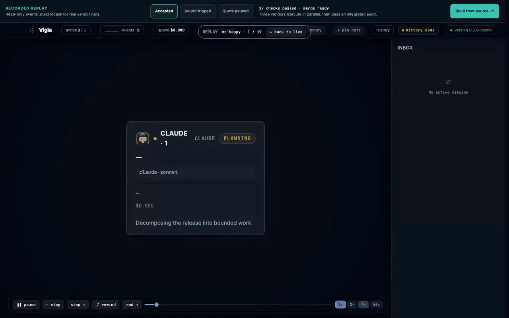
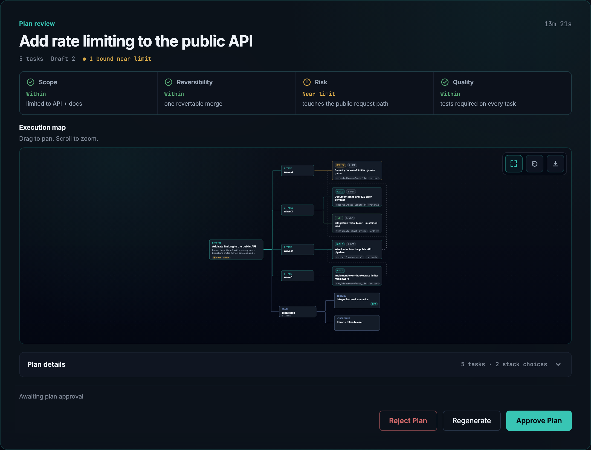
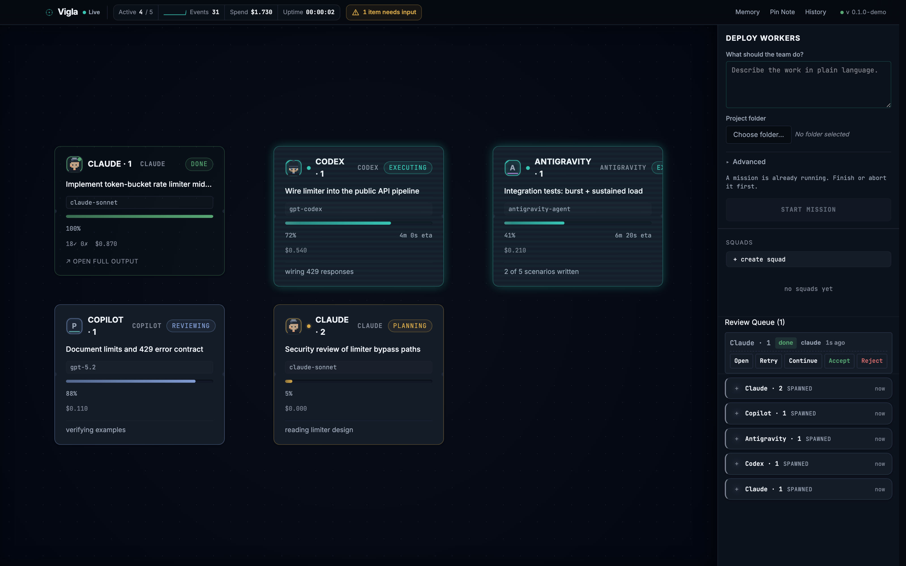
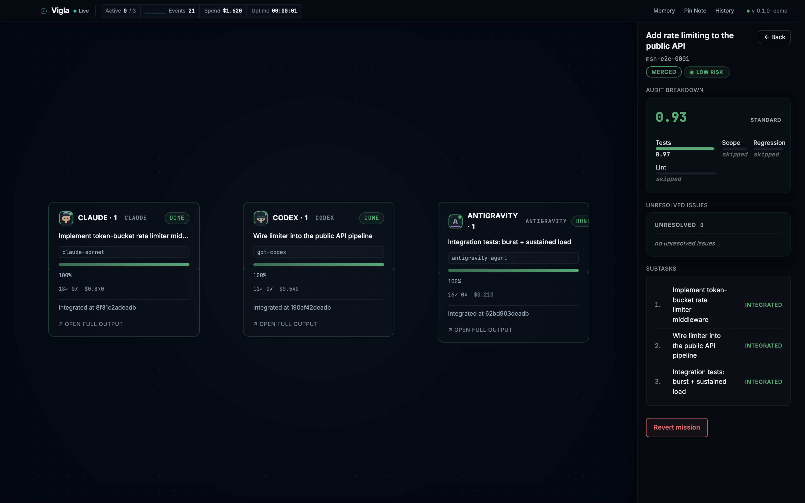
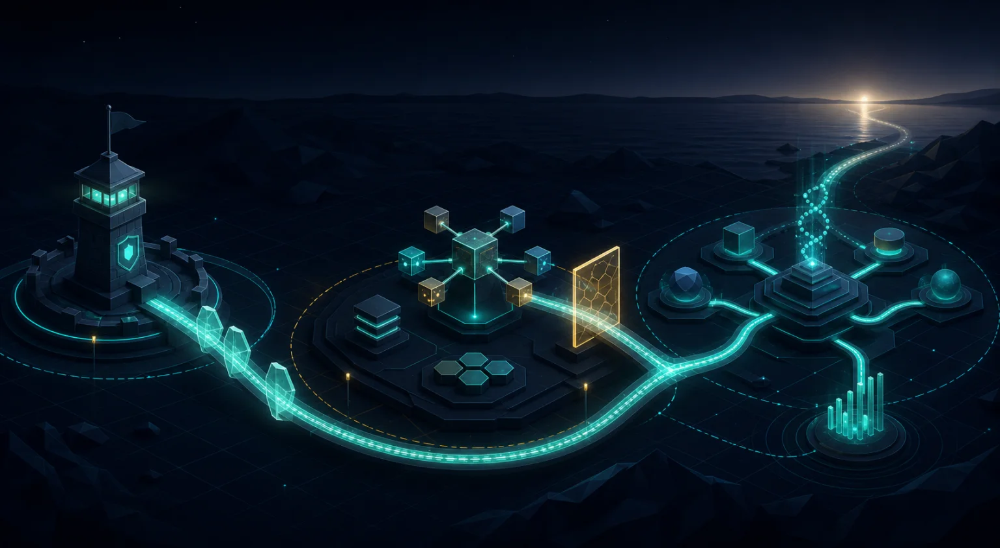

<div align="center">

# Vigla

**Supervise the merge. Not every terminal.**

Run Claude Code, Codex CLI, Antigravity, and other agent CLIs as one supervised
team — each agent in its own git worktree, every submission audited, every
mission reversible in one click.

[](https://github.com/Kilbex/Vigla/actions/workflows/ci.yml)
[](./LICENSE)
[](#requirements)
[](./CONTRIBUTING.md)

[Watch the replay](https://kilbex.github.io/Vigla/demo/) ·
[Website](https://kilbex.github.io/Vigla/) ·
[How it works](#how-it-works) ·
[Compare](#how-it-compares) ·
[Build a local DMG](#build-a-local-dmg) ·
[Architecture](./ARCHITECTURE.md) ·
[FAQ](./docs/faq.md) ·
[Roadmap](./ROADMAP.md) ·
[Contributing](./CONTRIBUTING.md)

<a href="https://kilbex.github.io/Vigla/demo/">
  
</a>

<sub>Deterministic recorded events · no account or credentials · click to open the interactive replay</sub>

</div>

Running one AI coding agent means babysitting one terminal. Running five
means five terminals, five diff reviews, and five chances to merge
something you never actually read. Vigla turns that into a single
operations room:

- **Two decisions, not two hundred.** You assign the mission and set the
  authority envelope. A supervisor agent decomposes the work, directs the
  workers, audits every submission, and escalates to you **only when one
  of four bounds trips: Scope, Reversibility, Risk, or Quality.**
- **Cross-vendor by design.** Claude Code, Codex CLI, Antigravity, and
  profile-backed agent CLIs can work the same mission side by side — pick
  the best agent for each task instead of the one you happen to have open.
  Adapters normalize every vendor's output into one canonical event stream.
- **Everything is reversible.** Each worker runs in an isolated git
  worktree; final merge records durable before/merged anchors. Reverting an
  entire mission creates a normal Git revert commit and preserves later work.
- **Local-first.** A Rust orchestrator, Tauri shell, and SQLite event
  store — no cloud control plane, account, or product telemetry. The default
  build adds no app-originated network traffic beyond the vendor CLIs you
  launch. An `EMBEDDINGS=1` build fetches its public embedding model into a
  local cache on first use, then performs inference locally.

> Vigla supervises the agent CLIs you already have. It does not wrap
> LLM APIs, run its own models, or add another billing layer.

**Launch receipt: 27/27 seeded failure trajectories escalated within the
default retry bounds.** Reproduce the fixed, credential-free case set with
`cargo xtask receipt`; the [method, data, and limitations](./docs/evidence/recovery-receipt.md)
are public and CI-checked.

## Try the no-install replay

[Open the read-only browser replay](https://kilbex.github.io/Vigla/demo/) to
step through accepted, bound-tripped, and quota-paused missions in the real
Operations Room UI. It runs entirely on recorded canonical events: no account,
vendor CLI, credentials, or network-backed agent is involved.

### Run the credential-free demo locally

Vigla ships with a deterministic mock harness, so you can watch a full
mission — decomposition, parallel workers, audit, verdict — without
credentials or token spend:

```sh
git clone https://github.com/Kilbex/Vigla.git && cd Vigla
pnpm install --frozen-lockfile
./scripts/dev.sh
```

When the Operations Room window opens, use the **Deploy** panel and pick
a bundled mock script. The deterministic scenarios cover happy paths,
blocked work, failures, and quota exhaustion — including the unhappy paths
most demos hide.

Prereqs: macOS 12+, [Rust 1.95](./rust-toolchain.toml) via rustup,
Node 22, pnpm 10, Xcode Command Line Tools. See
[CONTRIBUTING.md](./CONTRIBUTING.md#fast-start) for the full setup.

## How it works

**1 — Assign a mission inside an envelope.** Describe the goal, choose
the worker roster and models, and set the authority envelope. In review
mode the supervisor proposes a plan first — task graph, file scope, risk
fit — and waits for your approval:

<div align="center">



</div>

**2 — The supervisor arbitrates; you stay out of the loop.** Workers
execute in parallel worktrees while the supervisor reviews each
submission and decides **Accept / Extend / Scrub / Escalate** — inside
your envelope, without pinging you. Live state, diffs, tests, cost, and
raw terminals are always one click away if you *want* to watch.

<div align="center">



</div>

**3 — You judge results, not keystrokes.** Finished missions land in
your inbox with a structured verdict: audit score, test results, files
changed, residual-risk band, unresolved issues — and a revert button
that undoes the whole mission atomically:

<div align="center">



</div>

The vocabulary is small and precise — *mission*, *worker*, *envelope*,
*arbiter*, *verdict* — and defined in [docs/lexicon.md](./docs/lexicon.md).

## How it compares

The table is positioning, not a feature checklist. Each cell is backed
by a primary source below; cells are re-verified before each release.

*Sources verified 2026-07-21.* “Not documented” means the linked product
documentation does not describe that capability; it is not a claim that an
internal implementation is impossible.

| | Vigla | Codex app (OpenAI) | Claude Code on desktop (Anthropic) |
|---|---|---|---|
| Cross-vendor worker roster | yes | no; Codex agents | no; Claude agents |
| Parallel local agent sessions | yes | yes | yes |
| Isolated git worktrees | one per worker | built in | automatic or manual |
| Bound-based supervisor audit across workers | yes | not documented | not documented |
| Atomic mission merge + revert | yes | not documented | not documented |
| Deterministic demo without a vendor account | yes | not documented | not documented |

<details>
<summary><b>Sources</b></summary>

- **Vigla.** See this README and [ARCHITECTURE.md](./ARCHITECTURE.md) for positioning
  and goals; [LICENSE](./LICENSE) (Apache 2.0).
- **Codex app (OpenAI).**
  [Introducing the Codex app](https://openai.com/index/introducing-the-codex-app/)
  documents parallel agents, local and cloud work, and built-in worktree
  support.
- **Claude Code on desktop (Anthropic).**
  [Claude Code on desktop](https://code.claude.com/docs/en/desktop)
  documents parallel sessions and automatic worktree isolation; the
  [worktrees guide](https://code.claude.com/docs/en/worktrees) covers the
  underlying isolation flow.

</details>

## Vendor support

Real workers are driven from the in-app Deploy panel; the mock harness
covers demos and CI. Integration tests are the authoritative
verification path for the fully gated vendors.

| Vendor | Binary | Role | Verification |
|---|---|---|---|
| Claude Code | `claude` | supervisor + worker; session retry / continue | `real_claude_gate.rs`, `supervisor_live.rs` |
| Codex CLI | `codex` | worker | `real_codex_run.rs`, `supervisor_live.rs` |
| Antigravity | `agy` | profile-backed worker | `real_antigravity_run.rs` |
| Gemini CLI | `gemini` | legacy / enterprise worker | `supervisor_live.rs` |
| Kiro | `kiro-cli` | profile-backed worker | end-to-end verification pending |
| GitHub Copilot | `copilot` | profile-backed worker | end-to-end verification pending |

Google ended consumer **Login with Google** access for Gemini CLI on
2026-06-18. Vigla retains the adapter for existing enterprise and legacy
configurations, but Gemini CLI is no longer a primary launch path. Google
directs affected consumer users to Antigravity in its
[official deprecation notice](https://developers.google.com/gemini-code-assist/docs/deprecations/code-assist-individuals).

Mission supervision is Claude-backed today; non-Claude supervisor
options should be treated as experimental until their end-to-end tests
land. Vigla does not pin vendor CLI versions — the launch path
verifies each configured binary, and the (`#[ignore]`-gated) real-CLI
integration tests track adapter compatibility:

```sh
cargo test -p vigla-orchestrator --test real_claude_gate -- --ignored --nocapture
cargo test -p vigla-orchestrator --test real_codex_run   -- --ignored --nocapture
cargo test -p vigla-orchestrator --test real_antigravity_run -- --ignored --nocapture --test-threads=1
cargo test -p vigla-orchestrator --test supervisor_live  -- --ignored --nocapture
```

The Claude, Codex, and supervisor gates use `tests/samples/sandbox/`, a
workspace-excluded crate with a deliberately wrong `multiply` function. The
Antigravity gate creates the same kind of isolated failing Rust fixture in a
temporary repository. Each gate asserts that the agent fixed the defect.

## Feature tour

<details>
<summary><b>Mission launch and supervision</b></summary>

- **Deploy panel** — supervisor profile, worker vendor roster, worker
  count, model selections, plan mode, objective, folder, and optional
  scoped paths.
- **Plan governance** — direct mode, or review-first mode showing the
  generated plan, task graph, worker assignments, file scope, and
  envelope checks with approve / regenerate / abort.
- **Arbiter-driven supervision** — one supervisor per mission decides
  Accept / Extend / Scrub / Escalate without pausing inside the
  envelope.
- **Structured completion verdicts** — `CompletionVerdict` scores test
  pass, scope, regression, and lint into a residual-risk band
  (Low / Medium / High) with the full audit breakdown in the inbox.
- **Reversibility envelope** — task integrations and the final target merge
  receive distinct rollback anchors; `Revert mission` preserves later commits.
- **Inspectable aborts** — abort retains Vigla-owned branches and worktrees for
  diagnosis; the explicit `Clean up artifacts` action removes them later without
  changing the target branch.

</details>

<details>
<summary><b>Worker execution</b></summary>

- **Real CLI and mock workers** — Claude Code, Codex CLI, verified
  Antigravity, legacy Gemini CLI, profile-backed Kiro / Copilot, plus
  deterministic mock workers for development and demos.
- **Isolated worktrees** — each worker gets its own git worktree and
  branch; work is inspected, merged, discarded, or reverted without
  touching your main checkout.
- **Canonical event stream** — adapter-normalized status, cost, file,
  test, review, and terminal events (`event-schema`).
- **Session-aware recovery** — Claude workers support retry and
  follow-up continuation; quota windows can pause missions and resume
  them when the window reopens; failures are classified for retry,
  continuation, or escalation.

</details>

<details>
<summary><b>Operations room</b></summary>

- **Station canvas** — one tile per worker with dependency edges, live
  status, task, model, progress, ETA, cost, file and test counters.
- **Worker drawer** — result, feed, terminal, files, tests, cost, and
  plan tabs; stop, retry / continue, switch models, assign squads.
- **Review queue** — workers needing review surface as actionable cards
  with open, retry, continue, accept, and reject flows.
- **Live terminal capture** — raw stdout/stderr preserved alongside
  normalized events; a power-user feed with every event is one toggle
  away.
- **Squads** — group workers, designate leads, color-code the fleet.

</details>

<details>
<summary><b>Inbox, history, and replay</b></summary>

- **Mission inbox** — completions, escalations, side effects,
  unresolved issues, audit breakdowns, and revert eligibility in one
  right rail; macOS notifications when a bound trips while the app is
  unfocused.
- **Mission history** — browse audited missions with status, risk
  tier, and full drill-down.
- **Worker replay** — page through event history, play / pause, step,
  scrub, change speed, and return to live.

</details>

<details>
<summary><b>Memory and context</b></summary>

- **Local Memory Kernel** — repository-scoped memory written through a
  single-writer path and attached to future workers as context bundles.
- **Pinned notes + auto-promoted insights** — pin facts, decisions, and
  hazards; completed work proposes durable notes after validation.
- **Safety filters** — memory writes are size-limited, schema-checked,
  secret-scanned, and drift-checked.
- **Vendor-native files as render targets** — `CLAUDE.md`, `AGENTS.md`,
  and `GEMINI.md` are generated projections, never the source of truth.

</details>

## Built in public

<div align="center">

<a href="./ROADMAP.md">
  
</a>

<sub>A visual interpretation of the public roadmap. The linked document is the source of truth.</sub>

</div>

| Now | Next | Later |
|---|---|---|
| Harden real-CLI gates, local packaging, first run, and regression coverage | Verify more adapters and supervisors; prove [Mac App Store sandbox feasibility](./docs/roadmap/mac-app-store.md) | Add Linux and Windows parity, richer memory provenance, reusable missions, and a public fleet benchmark |

Priorities move with operator evidence and focused contributions. See the
[full roadmap](./ROADMAP.md) for acceptance boundaries and the work Vigla
deliberately will not take on.

## Tech stack

| Layer | Choice |
|---|---|
| Desktop shell | Tauri 2 (Rust host) |
| Orchestrator | Rust 1.95, `tokio`, `sqlx` (SQLite), `tracing` |
| UI | React 19, Vite, TypeScript, Tailwind v4, Zustand |
| Canvas & terminal | React Flow (`@xyflow/react`), xterm.js |
| IPC | `tauri-specta` typed bindings (Rust → TS) |
| Tests | cargo test, Vitest, Playwright |

The only abstraction Vigla permits is the event boundary: vendor CLI
bytes → canonical events. Adapters live in `crates/adapters/{vendor}`, one
crate per vendor, pure translation — no I/O, no process spawning, no
git.

<details>
<summary><b>Storage paths</b></summary>

| Path | What | Override |
|---|---|---|
| `~/Library/Application Support/Vigla/vigla.sqlite` | Events, missions, workers, memory index | `VIGLA_DB_PATH` |
| `<repo>/.vigla/memory/notes/` | Long-term memory notes (Markdown), one store per repo | rooted at the repo's canonical git root, not under `VIGLA_DB_PATH` |
| `~/Library/Logs/Vigla/vigla.log.YYYY-MM-DD` | Rolling daily structured logs | managed by `tracing-appender` |

</details>

<details>
<summary><b>Repo layout</b></summary>

```
vigla/
├── app/                  # Tauri 2 + React 19 + Vite + TS
│   ├── src/              # React UI, Zustand stores, hotkeys
│   └── src-tauri/        # Tauri host (Rust): IPC, event forwarding
├── crates/               # All Rust library/bin crates (Cargo workspace)
│   ├── orchestrator/     # Rust supervision crate (business logic)
│   │   ├── src/memory/               # Memory Kernel (event-sourced)
│   │   ├── src/mission_runtime/      # Mission state machine + replay
│   │   ├── src/mission_supervisor_run/ # Supervisor turns + review loop
│   │   ├── src/supervisor/           # Worker process lifecycle + resume
│   │   ├── src/arbiter/              # Bound-based escalation decisions
│   │   └── resources/                # Bundled at compile time:
│   │       ├── vendor_profiles/      #   per-vendor command-rendering policy
│   │       └── skills/               #   worker skill set (embedded)
│   ├── adapters/         # One pure crate per vendor CLI + supervisor
│   ├── event-schema/     # Canonical typed event contract
│   ├── mock-harness/     # Mock vendor CLI (credential-free demos)
│   └── xtask/            # Workspace task runner (cargo xtask)
├── tests/                # Playwright e2e specs + real-CLI sample targets
├── docs/                 # Lexicon, good-first-issues, media
└── scripts/              # dev.sh, build.sh, capture-readme-media.cjs
```

</details>

Deep dive: [ARCHITECTURE.md](./ARCHITECTURE.md) covers the orchestrator,
memory kernel, mission lifecycle, arbiter / audit / recovery, event
schema, and per-vendor adapters.

## Requirements

- **macOS 12+.** Linux and Windows are on the [roadmap](./ROADMAP.md) —
  the non-host Rust workspace is built, linted, and tested on Linux in CI;
  desktop packaging and platform UX are scoped on the roadmap.
- Development: Rust 1.95 (pinned via `rust-toolchain.toml`), Node 22.x,
  pnpm 10.x, Xcode Command Line Tools.
- Vendor CLIs are optional and only needed for real (non-mock) workers.

## Build a local DMG

Vigla does not publish maintainer-built binaries. On a Mac, clone the source and
run one command:

```sh
./scripts/build.sh
```

The script installs the locked frontend dependencies, builds the application,
ad-hoc signs it without an Apple account or personal signing identity, verifies
the app and disk image, and prints the DMG path and SHA-256 checksum. The local
artifact remains under `target/release/bundle/dmg/`; no workflow uploads it.

Keep the printed checksum with the artifact. [SECURITY.md](./SECURITY.md#verifying-a-local-build)
documents the independent `shasum`, `hdiutil`, and `codesign` checks.

Prerequisites are the development tools listed in [Requirements](#requirements).
Set `EMBEDDINGS=1` when running the command to include the optional embeddings
feature. Its first use downloads the public FastEmbed model into the per-user
cache; if that download is unavailable, retrieval falls back to local BM25.

## Known limitations

Design trade-offs in the current build, not bugs:

- **Real supervisor execution is Claude-gated.** The production
  mission-supervisor path and its end-to-end verification are
  Claude-backed today.
- **Memory retrieval is local and best-effort.** Alias-expanded BM25
  with optional embedding / hybrid re-ranking; degrades to lexical
  retrieval instead of blocking workers.
- **The supervisor sees typed mission events, not raw worker
  dialogue.** By design — escalation is bounded on outcomes, not
  chain-of-thought.
- **Session resume requires vendor session-ID support.** CLIs that
  don't expose a session ID can't be continued across app restarts.

## Why "Vigla"?

**Vigla** (Byzantine Greek *βίγλα*, "watchpost" — from Latin *vigilia*,
the root of *vigilance*) was the imperial guard regiment that kept the
night watch on campaign: it posted the sentries, held the watchword,
and ran the signal line so the emperor could actually sleep. That is
this app's entire job — a supervisor that keeps trained watch over a
fleet of powerful agents and wakes you only when something crosses a
bound.

In category terms: Vigla is an open-source control plane for supervised
agent operations — coordinating fleets of AI coding agents instead of
babysitting them one terminal at a time.

## Contributing

Start with [CONTRIBUTING.md](./CONTRIBUTING.md) and
[ARCHITECTURE.md](./ARCHITECTURE.md); project authority and maintainer
succession are explicit in [GOVERNANCE.md](./GOVERNANCE.md).
Newcomer-friendly tasks live in
[docs/GOOD_FIRST_ISSUES.md](./docs/GOOD_FIRST_ISSUES.md) — adapter
fixture work is the recommended first PR and is designed to land in
under two hours.

Questions and bug-report routing: [SUPPORT.md](./SUPPORT.md). Security reports:
see [SECURITY.md](./SECURITY.md). Reviewing or recording Vigla? The public
[creator kit](./docs/operations/creator-kit.md) provides a 10-minute script,
credential-free inputs, media, evidence, and exact claim boundaries.
Operators coming from vibe-kanban can use the
[concept-by-concept migration guide](./docs/migrations/from-vibe-kanban.md);
it does not claim a database importer or kanban-board parity.

## License

[Apache 2.0](./LICENSE), with the project [NOTICE](./NOTICE). Bundled component
attribution and retained licenses are in
[THIRD_PARTY_NOTICES.md](./THIRD_PARTY_NOTICES.md); the generated,
self-contained [THIRD_PARTY_NOTICES.txt](./THIRD_PARTY_NOTICES.txt) covers the
locked production Rust and JavaScript dependency graphs.

---

<div align="center">

If Vigla looks useful, **a ⭐ helps other agent operators find it.**

</div>
